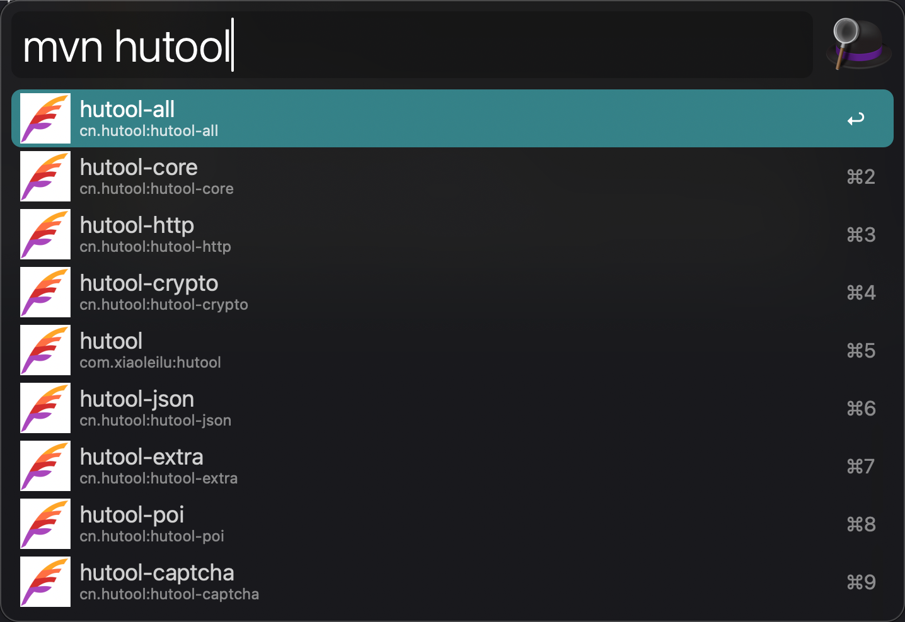
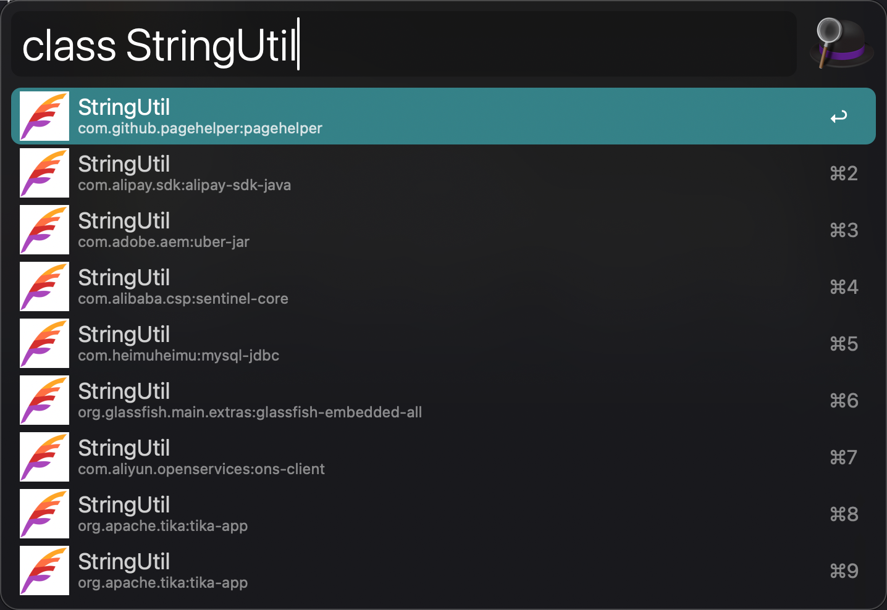
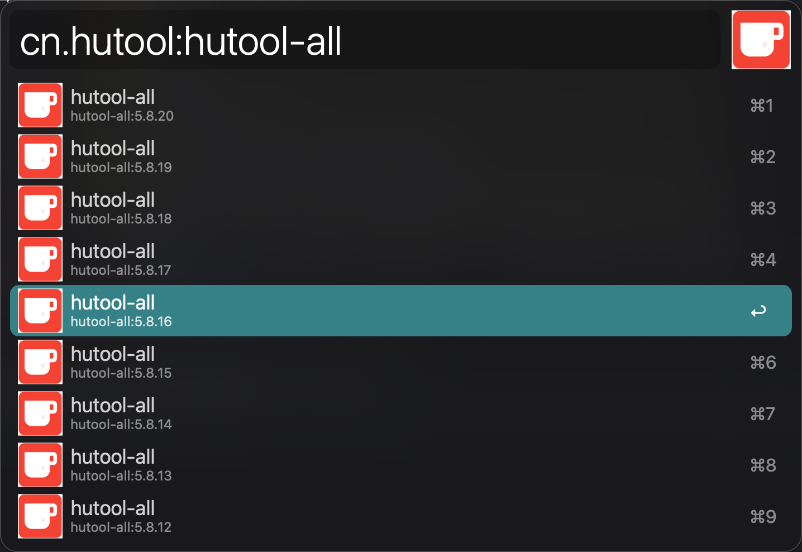

# Maven Search Alfred插件

因为之前下载的mavenSearch插件不能使用(可能是年代久远),因此写了一个新的,希望能帮到你

下载mavensearch.workflow文件并安装

要求安装node.js

本地测试请运行npm install

输入mvn {要搜素的jar包名字，支持模糊搜索}

输入class {要搜素的类名，大小写敏感，请全部输入} (类名搜索比较慢，不推荐使用)

在出现的选项里选择想要的jar包点击回车

选择版本然后按回车，自动复制maven依赖到剪贴板

                <dependency>
                    <groupId>cn.hutool</groupId>
                    <artifactId>hutool-all</artifactId>
                    <version>5.8.20</version>
                </dependency>
